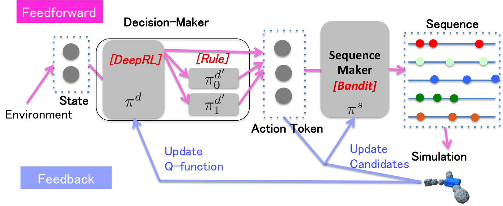

# MotionGenerator

Authors' implementation of `Real-Time Motion Generation for Imaginary Creatures Using Hierarchical Reinforcement Learning`


Some demo are available on another repository https://github.com/dwango/RLCreature

Overview
---------



* Decision-Maker
  * [recommended] ReinforcementDecisionMaker
    * use Deep Q-Learning for decision making
  * FollowPointDecisionMaker
    * just following the target objects
* Sequence-Maker
  * [recommended] EvolutionarySequenceMaker
    * use Evolutionary strategy for generating motions for target creature's body
  * SimpleBanditSequenceMaker
  * RandomSequenceMaker


Usage
---------

More higher level API is available at https://github.com/dwango/RLCreature repository

```csharp
var actions = LocomotionAction.EightDirections();
var sequenceMaker = new EvolutionarySequenceMaker(epsilon: 0.3f, minimumCandidates: 30);
var decisionMaker = new ReinforcementDecisionMaker();
var brain = new MotionGenerator.Brain(
    decisionMaker,
    sequenceMaker
);
brain.Init(
    new List<int> {(new ManipulatableMock()).GetManipulatableDimention()},
    actions,
    new List<ISoul>() {new GluttonySoul()}
);


// Position, Rotation is required to update LocomotionAction
// GluttonySoul.Key is required to update GluttonySoul
// others are used to decide action
brain.GenerateMotionSequence(new State(new Dictionary<string, Vector>()
{
    {State.BasicKeys.RelativeFoodPosition, DenseVector.OfArray(new double[]{0.5f, 0.5f, 0.5f})},
    {State.BasicKeys.BirthPosition, DenseVector.OfArray(new double[]{0f, 0f, 0f})},
    {State.BasicKeys.Position, DenseVector.OfArray(new double[]{0f, 0f, 0f})},
    {State.BasicKeys.Rotation, DenseVector.OfArray(new double[]{0f, 0f, 0f, 0f})},
    {GluttonySoul.Key, DenseVector.OfArray(new double[]{0f})}
}));

// NextAction
// Note that GluttonySoul.Key is incremented (This creature caught a food!)
brain.GenerateMotionSequence(new State(new Dictionary<string, Vector>()
{
    {State.BasicKeys.RelativeFoodPosition, DenseVector.OfArray(new double[]{0.5f, 0.5f, 0.5f})},
    {State.BasicKeys.BirthPosition, DenseVector.OfArray(new double[]{0f, 0f, 0f})},
    {State.BasicKeys.Position, DenseVector.OfArray(new double[]{0.1f, 0f, 0f})},
    {State.BasicKeys.Rotation, DenseVector.OfArray(new double[]{0f, 0f, 0f, 0f})},
    {GluttonySoul.Key, DenseVector.OfArray(new double[]{1f})}
}));
```
